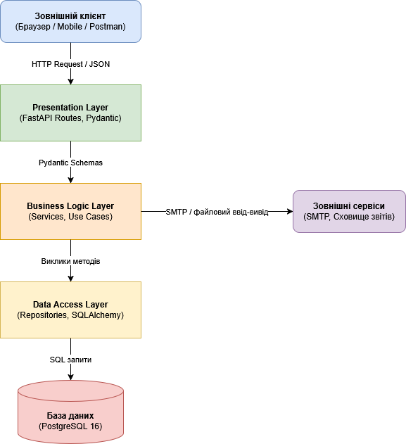

# Архітектура системи Expense Tracker

## 1. Опис домену проєкту

**Яку проблему вирішує система?**
Expense Tracker вирішує проблему відсутності контролю над особистими фінансами. Система надає інструменти для систематичного обліку витрат, їх категоризації та аналізу, що дозволяє користувачам уникати перевитрат та приймати обґрунтовані фінансові рішення.

**Хто користувачі?**
* **Гість (Guest):** Неавторизований відвідувач, який може зареєструватися.
* **Користувач (User):** Авторизований учасник. Може додавати витрати, управляти категоріями/бюджетами та переглядати аналітику.
* **Адміністратор (Admin):** Має доступ до управління всіма користувачами, глобальними категоріями та системними логами.

**Які основні операції виконує система?**
1. Створення, редагування, видалення та перегляд витрат.
2. Створення та управління власними категоріями витрат.
3. Встановлення місячних бюджетів на категорії.
4. Формування аналітичних звітів за періоди (день, тиждень, місяць).
5. Автентифікація та управління профілем користувача.
6. Фільтрація транзакцій за датою, сумою та категоріями.
7. Експорт даних (звітів) у форматі PDF/CSV.

**Які зовнішні системи є?**
* **База даних:** PostgreSQL 16 (зберігання даних).
* **Поштовий сервіс:** SMTP-сервер (email-підтвердження, сповіщення про ліміти бюджету).
* **Файлове сховище:** Локальне або хмарне (зберігання згенерованих звітів).

## 2. Вибір архітектурного стилю

| Критерій вибору | Аналіз для проєкту Expense Tracker |
| :--- | :--- |
| **Розмір команди** | 1 розробник. |
| **Складність бізнес-логіки** | Прості CRUD-операції з елементами розрахунку бюджетів та агрегації для аналітики. |
| **Вимоги до масштабування** | Низькі. Очікується до 1000 користувачів, масштабувати окремі частини не потрібно. |
| **Терміни** | MVP за 4-6 тижнів. |
| **Мій вибір** | **Layered architecture з патерном MVC** |

## 3. Архітектурна схема

*(Примітка: сюди потрібно покласти згенерований PNG файл з draw.io)*

## 4. Структура директорій проєкту

src/
├── api/                  # Presentation layer: обробка HTTP запитів
│   └── routes/
│       ├── users.py
│       └── expenses.py
├── services/             # Business Logic layer: бізнес-правила та розрахунки
│   ├── user_service.py
│   └── expense_service.py
├── repositories/         # Data Access layer: робота з базою даних
│   ├── user_repo.py
│   └── expense_repo.py
├── models/               # Моделі даних (SQLAlchemy)
│   ├── user.py
│   └── expense.py
└── schemas/              # Схеми валідації (Pydantic)
    └── expense_schema.py
docs/
├── architecture.md
├── architecture.png
└── adr/
    └── 001-architecture-style.md
	
## 5. Рішення щодо якості коду (SOLID)

**Застосовані принципи SOLID:**
* **SRP (Single Responsibility):** Кожен клас має одну відповідальність. Наприклад, `ExpenseRepository` робить лише SQL-запити, `NotificationService` лише відправляє повідомлення, а `ExpenseService` виконує бізнес-правила.
* **OCP (Open/Closed):** Додавання нових форматів експорту (CSV, PDF) реалізується через створення нових методів у `ReportService`, не змінюючи існуючу логіку фільтрації.
* **DIP (Dependency Inversion):** Сервіси (`ExpenseService`) не створюють підключення до БД всередині себе, а отримують абстрактний `ExpenseRepository` через конструктор (Dependency Injection). Це дозволяє легко підставляти Mock-об'єкти під час тестування.

**Структура модулів:**
Файли розбиті за принципом Separation of Concerns (SoC) — за шарами архітектури:
* `api/routes/` — обробка HTTP.
* `services/` — правила домену.
* `repositories/` — доступ до PostgreSQL.

**Code Smells, яких ми уникаємо:**
* **Magic Numbers:** Замість хардкоду чисел використовуються іменовані константи (наприклад, `MAX_EXPENSE_AMOUNT = 1_000_000`).
* **Duplicate Code:** Логіка валідації email або сум виноситься в окремі чисті функції або методи, дотримуючись принципу DRY.