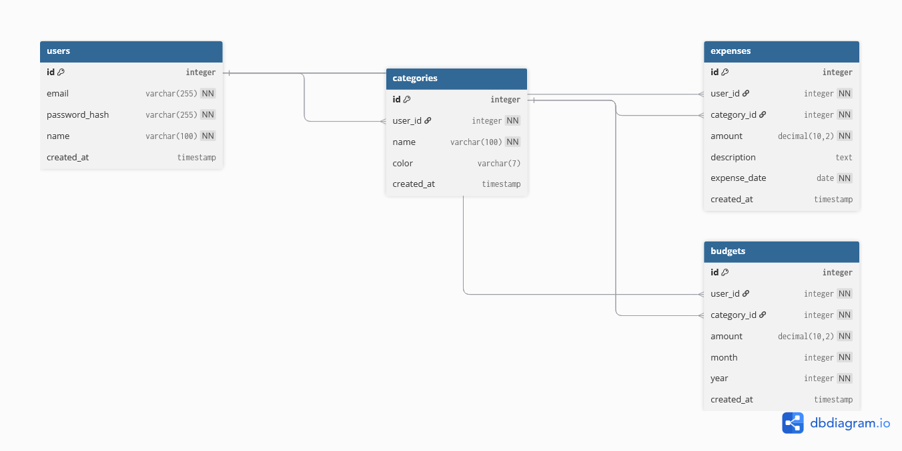

# Схема бази даних Expense Tracker

## 1. Сутності та таблиці

1. **`users`** — зберігає дані користувачів системи.
   * Основні поля: `id` (PK), `email`, `password_hash`, `name`, `created_at`.
2. **`categories`** — користувацькі категорії витрат.
   * Основні поля: `id` (PK), `user_id` (FK), `name`, `color`, `created_at`.
3. **`expenses`** — записи про фінансові транзакції (витрати).
   * Основні поля: `id` (PK), `user_id` (FK), `category_id` (FK), `amount`, `description`, `expense_date`, `created_at`.
4. **`budgets`** — встановлені ліміти витрат на конкретну категорію в певному місяці.
   * Основні поля: `id` (PK), `user_id` (FK), `category_id` (FK), `amount`, `month`, `year`, `created_at`.

## 2. Зв'язки між сутностями

| Таблиця А → Таблиця В | Тип зв'язку | FK-поле |
| :--- | :--- | :--- |
| `users` → `categories` | 1:N (один юзер, багато категорій) | `categories.user_id` |
| `users` → `expenses` | 1:N (один юзер, багато витрат) | `expenses.user_id` |
| `users` → `budgets` | 1:N (один юзер, багато бюджетів) | `budgets.user_id` |
| `categories` → `expenses`| 1:N (одна категорія, багато витрат) | `expenses.category_id` |
| `categories` → `budgets` | 1:N (одна категорія, багато бюджетів)| `budgets.category_id` |

## 3. Аналіз нормалізації схеми

Схема повністю відповідає першим трьом нормальним формам (1NF-3NF):
1. **1NF:** Немає жодного поля, що містить множинні значення (масиви або списки через кому). Усі значення атомарні.
2. **2NF:** Кожна таблиця має простий (сурогатний) первинний ключ `id`. Отже, часткова залежність від ключа виключена за визначенням.
3. **3NF:** У таблиці `expenses` ми зберігаємо `category_id` (покликання на таблицю `categories`), а не назву категорії напряму. Це виключає транзитивні залежності і дублювання даних.

## 4. ER-діаграма

## 5. Інструкція із застосування

Для ініціалізації схеми бази даних необхідно підключитися до PostgreSQL та виконати SQL-скрипт:

psql -U username -d expense_tracker_db -f docs/database/schema.sql